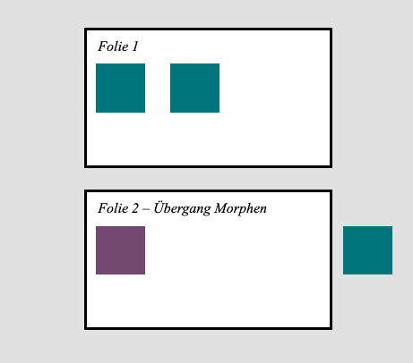
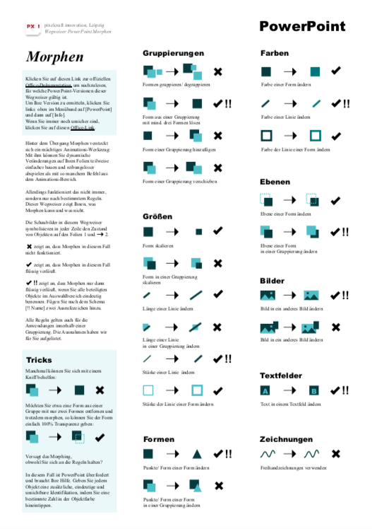

# Profi-Animationen im Handumdrehen: Wie Sie auf einen Blick Morphing in PowerPoint meistern

{>>Überschrift ist noch zur Diskussion offen:<<}
{>>Blitzschnelle Profi-Animationen in PowerPoint: Meistern Sie Morphing mit dieser einfachen Übersicht<<}
{>>PowerPoint-Animation ist kein Hexenwerk: Wie Sie mit minimalem Aufwand Ihr Publikum bezaubern wenn Sie diese einfachen Morphing-Regeln beachten<<}
{>>PowerPoint-Animation ist kein Hexenwerk: Wie Sie sich mit diesen einfachen Tricks ins Herz Ihres Publikums morphen<<}
{>>Wie Sie bessere PowerPoint-Folien in kürzerer Zeit erstellen: Heben Sie Ihre Animationen auf ein neues Level mit diesen einfachen Morphing-Tricks<<}
{>>Wie Sie Ihre PowerPoint-Animationen auf ein neues Level heben mit diesen einfachen Morphing-Tricks<<}
{>>Diese Morphing-Übersicht wird Ihr Ass im Ärmel: Verblüffen Sie in PowerPoint mit weniger Aufwand als je zuvor<<}
{>>Schluss mit Frust in PowerPoint: Wie Sie mit ein paar einfachen Regeln stressfrei animieren lernen<<}
{>>Morphing kann so einfach sein: Wie Sie mit ein paar einfachen Grundregeln das meiste aus PowerPoint-Animationen herausholen<<}

Dass PowerPoint-Präsentationen animierbar sind, ist allgemein bekannt.
Aber wussten Sie auch, dass das Programm hierfür mehr Werkzeuge bereitstellt als nur die Registerkarte [Animationen]? 

#### Animieren durch Übergänge

Sicher haben Sie schon einmal die Registerkarte [Übergänge] genutzt, um das Ablösen einer Folie durch die nächste zu gestalten.
<label for="aside--Sicher haben Sie schon einmal die Registerkarte" class="aside-toggle" role="button" aria-pressed="false" aria-label="Randbemerkung anzeigen" onkeypress="toggleButtonKeyPress()" onclick="toggleButtonClick()" tabindex="0">⨭ …</label>

<input id="aside--Sicher haben Sie schon einmal die Registerkarte" type="checkbox" class="aside-toggle"/>

**Notiz**: Wenn Sie in PowerPoint noch keine [Übergänge] genutzt haben, dann probieren Sie sich ruhig mal aus! Klassisch schöne Varianten wie das [Schieben] eignen sich, um Geschichten in Szenen zu erzählen. Experimentelleres wie [Origami] eignet sich vor allem, um ein Mal kurz zu Staunen und dann die Finger davon zu lasssen.

Und sicher ist Ihnen dort auch das [Morphen] aufgefallen. Immerhin ist das gleich die erste angezeigte Option.

#### Spezialfall Morphen: mehr als nur ein Übergang

Morphen ist ein Übergang, der unter anderen Optionen heraussticht. 

Denn hier versucht PowerPoint, alle Objekte auf der ersten Folie möglichst dynamisch in die Objekte auf der zweiten Folie zu verwandeln. Dadurch entsteht eine flüssige Animation, die aussieht, als wäre sie innherhalb einer Folie gebaut worden.

Eine Animation, die manchmal geradezu magisch ausfällt …

<video poster="" alt="Morph-Animation funktioniert" class="drop-shadow" controls loop muted preload="metadata"><source src="Zylindertrick Morphing funktioniert.mp4" type="video/mp4">Entschuldigung, Ihr Browser unterstützt das Video-Format nicht.</video>

.… und manchmal ...

<video poster="" alt="Morph-Animation funktioniert nicht" class="drop-shadow" controls loop muted preload="metadata"><source src="Zylindertrick Morphing funktioniert nicht.mp4" type="video/mp4">Entschuldigung, Ihr Browser unterstützt das Video-Format nicht.</video>

.… verflixt nochmal scheitert.

Kein Wunder also, dass das Morphen ein Schattendasein führt in der Schublade für dunkle PowerPoint-Magie. Wer will schon einen Übergang nutzen, auf den eigentlich kein Verlass ist? 

Die Antwort ist: Sie.

Wenn Sie verstehen, was eigentlich hinter der Magie passiert, können Sie Morphen sehr wohl sinnvoll nutzen - und sich damit ein Animations-Werkzeug erschließen, das nicht nur Ihr Publikum bezaubert, sondern auch noch Ihre Arbeit minimiert.

Das machen Sie schon? Super! Dann springen Sie hier zu den Profi-Tipps!
{>>Das Wort "hier" oder "Profi-Tipps" muss noch mit dem entsprechenden Absatz "Wann Morphing funktioniert" weiter unten verlinkt werden.<<}

Sie müssen das erst noch ausprobieren? Auch gut. Jetzt ist der beste Zeitpunkt. 
Bitte treten Sie hinter die Kulissen und tun ganz einfach Folgendes:

#### Wie Morphen funktioniert

1. Legen Sie zwei Formen auf einer Folie an. 
*Für das Beispiel unten haben wir einfach zwei Quadrate genommen.*

2. Kopieren Sie die Folie, sodass Sie eine zweite, identische Folie haben.

3. Verändern Sie diese zweite Folie, indem Sie ...
    1. … die Farbe der ersten Form ändern.
    2. … die Position der zweiten Form ändern.

*Schieben Sie die zweite Form ruhig bis ganz aus dem später sichtbaren Bereich der Folie hinaus.*

4.	Immernoch auf der zweiten Folie klicken Sie oben im Menü auf die Registerkarte [Übergänge] und wählen dort [Morphen] aus.

Schauen Sie sich das Ergebnis an! 

Was ist passiert? 

Die erste Form hat wie von Zauberhand ihre Farbe geändert. 
Die zweite hat sich aus der Folie hinausbewegt.

<video poster="" alt="Morph-Animation nach Anleitung" class="drop-shadow" controls loop muted preload="metadata"><source src="Morphen Beispiel simpel.mp4" type="video/mp4">Entschuldigung, Ihr Browser unterstützt das Video-Format nicht.</video>

PowerPoint hat versucht, einen gleitenden Übergang von der Formen-Konstellation auf Folie 1 zu der Formen-Konstellation auf Folie 2 zu schaffen. 

Und weil auf beiden Folien die gleichen Formen vertreten sind - ob nun sichtbar oder außerhalb der Foliengrenzen - sieht das Ergebnis nicht wie ein Übergang zwischen zwei verschiedenen Folien aus, sondern wie eine Animation. 

Und genauso können Sie dieses Werkzeug auch nutzen: 
Sehen Sie Folie 1 als Ihre Ausgangsposition und bauen Sie auf Folie 2 Ihr gewünschtes Endresultat! 
PowerPoint konstruiert automatisch alle Bewegungen dazwischen und nimmt Ihnen damit jede Menge Arbeitsschritte ab.

#### Wann Morphen funktioniert

Sie wissen also, wie Sie mithilfe von Morphen kinderleicht Animationen zaubern können. 

Sie sind begeistert. 
Und frustriert.

Denn obwohl Sie verstehen, wie das Werkzeug funktionieren sollte -  manchmal versagt es trotzdem. Scheinbar einfach so. 

Manche Übergänge kann das Programm wohl nicht verarbeiten.
Aber welche?

Wir haben es für Sie ausprobiert. Und Ihnen eine Übersichts-PDF zum kostenlosen Download erstellt:
{>>Die Worte "kostenloser Download" müssen noch mit dem entsprechenden Download-Link für die PDF verlinkt werden.<<}

Hier finden Sie alle Möglichkeiten und Grenzen der Morph-Magie inklusive aller Geheim-Zaubersprüche, die mit „!!“ anfangen. Die funktionieren zwar auch nicht immer, aber jetzt wissen Sie wenigstens, wann. 

Vorausgesetzt, Sie haben eine der folgenden PowerPoint-Versionen:

| Produkt                                                     | Version Nr.      |
|-------------------------------------------------------------|------------------|
| PowerPoint für Office 365 für Windows, Monatlicher Kanal    | 1903             |
| PowerPoint für Office 365 für Windows, Halbjährlicher Kanal | 1908             |
| PowerPoint für Office 365 für Mac                           | 16.23            |
| PowerPoint 2019 für Windows                                 | 1908             |
| PowerPoint 2019 für Mac                                     | 16.28, 16.0.4888 |
|                                                             |                  |

#### Wie Sie Zeit durch Planen sparen

Sobald Sie wissen, was wann funktioniert, können Sie Ihre Präsentationen auch effektiv planen:

- Lässt sich eine gewünschte Animation mit Morphen realisieren? Hervorragend. Nutzen Sie das! Damit sind Sie allemal schneller, als wenn Sie jede Bewegung einzeln im Menü [Animationen] nachbauen. Sie sparen wertvolle Zeit.
- Versagt Morphen im gewünschten Fall? Egal. Probieren Sie es gar nicht erst aus. Gehen Sie direkt ins Menü [Animationen] und bauen Sie dort diesen Teil per Hand. Alles andere kostet Sie wertvolle Zeit.