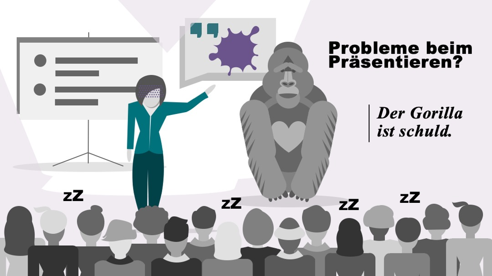
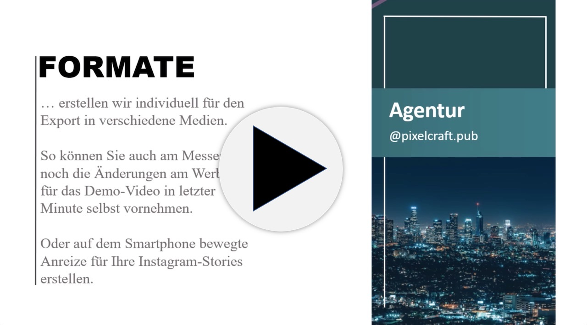

*Präsentation ist die Kunst, Informationen eine verständliche Gestalt zu geben. Das tun wir in Folien, Animationen, Dokumenten und Postern. Wir kümmern uns um die passende Kommunikations-Architektur für Ihre Ideen und befähigen Sie, zu überzeugen: auf der Bühne, in der Konferenz oder mit Medien-Artefakten.*

<nav>

- [Folien][]			
- [Schulung][]				
- [Artefakte][]		

</nav>

## Präsentations-Folien [Folien]

Das beliebteste Werkzeug zur Folienproduktion ist PowerPoint. Wir können damit (aber auch mit anderen Programmen) Außergewöhnliches möglich machen: *Folien, die Ihnen Arbeit abnehmen*.

<!-- @include _cta-form-ppt -->

## Präsentations-Schulung [Schulung]

In Meetings, bei Veranstaltungen oder im Büro, beim Zuhören und beim Erstellen: Ständig fressen Präsentationen Zeit im Arbeitsalltag. Und dann sind sie oft noch nicht mal besonders effektiv. *Das wollen wir ändern!* Deshalb haben wir Lernwerkstätten und Produkte entwickelt, die Ihnen Zeit und Nerven sparen, während Sie Spaß und Effektivität erhöhen.

Sie wollen sicher stellen, dass Sie auf der Bühne einen überzeugenden Auftritt hinlegen? Wir haben einen *methodischen Unterbau<* für Sie geschaffen. Mit einem Fundament aus Wahrnehmungspsychologie und Kognitions-Wissenschaft können Sie beruhigt den nächsten Vortrag angehen.<!-- TODO Illustration und/oder PDF zum Download -->

## Präsentations-Artefakte [Artefakte]

Wir produzieren Medien, um Ihre Ideen zu vermitteln und zu verbreiten. Sparen Sie Zeit und Nerven: Wählen Sie aus unserer Vorlagen-Bibliothek für Ihre Bedürfnisse aus. Alles lässt sich mit Office-Programmen von Ihnen selbst anpassen.

Wir helfen Ihnen nicht nur, auf der Bühne oder im Meeting zu überzeugen. Wir befähigen Sie mit Vorlagen und Schablonen, Ihre Medienproduktion selbst in die Hand zu nehmen. Poster, die Ihre Erläuterungen an die Arbeitsplätze tragen, wo Sie gebraucht werden. Video-Animationen, deren Inhalt Ihr Vertriebsteam selbst während der Messe aktualisieren kann. Illustrierte Handbücher, die wichtige Details anschaulich erläutern. Und ein paar Dinge mehr.

Video laden (2Min, 50MB)<video id="video-001" style="display:none;" autoplay loop muted class="drop-shadow" alt="Animationssequenzen in PowerPoint"><source src="" type="video/mp4">Entschuldigung, Ihr Browser unterstützt das Video-Format nicht.</video><noscript><a href="ppt-demo.mp4">zum Video (ohne JavaScript)</a></noscript>
